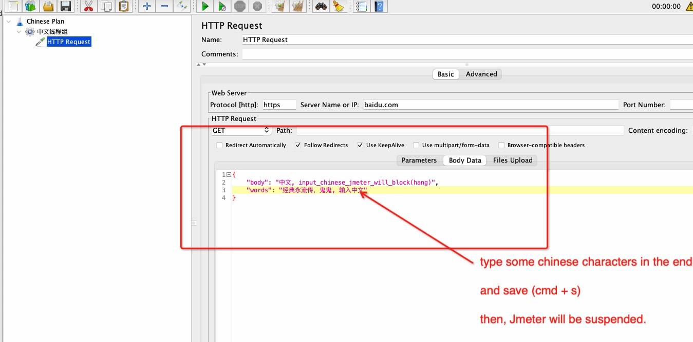

# Re-produce demo

- Step 1、git clone the repo. open jmx file.

```shell
mvn jmeter:configure jmeter:gui -DguiTestFile=src/test/jmeter/Chinese_Plan.jmx
```

- Step 2、edit HTTP Request Body Dada text area in (中文线程组) Thread Group. type some Chinese characters and save.



and then, Jmeter GUI be suspended, I can't do anything. The log file ([target/jmeter/logs/Chinese_Plan.log](./Chinese_Plan.jmx.log)) can not find any helpful information.

## Re-produce machine info

- os.name=Mac OS X
- os.arch=x86_64
- Apache Maven 3.8.2 (ea98e05a04480131370aa0c110b8c54cf726c06f)
- java.version=11.0.17, [download links](https://www.azul.com/downloads/?version=java-11-lts&os=macos&architecture=x86-64-bit&package=jdk-fx)


